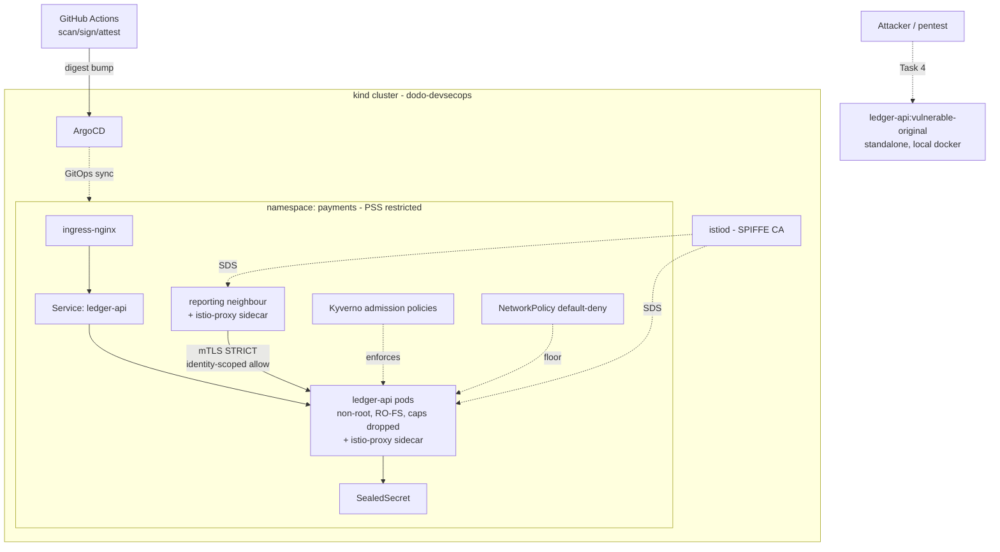

# Dodo Payments — DevSecOps Assessment

Security & DevOps Engineer technical assessment: harden `ledger-api` end to end, prove
the controls work, then pentest it. Everything runs fully local (kind + free
tooling) — no cloud account required.

## Approach summary

`ledger-api` (the assignment's starter app) is deliberately vulnerable at the code
level (unsafe YAML deserialization, SSRF, no authentication, weak tokenization,
plaintext secrets). Rather than silently patching the code up front, this submission
keeps that split explicit and uses it as the throughline across all four tasks:

- **Tasks 1 and 3** harden the *infrastructure* around the still-vulnerable
  application (Kubernetes security context, admission control, secrets management,
  service mesh identity, network segmentation) — proving that defense-in-depth
  contains and limits the blast radius of the app-level flaws even before they're
  fixed in code.
- **Task 4** finds those exact flaws through a real black-box pentest, exploits them
  (including a full unauthenticated-RCE-to-secrets-exfiltration chain), *then* fixes
  the application code and retests every finding closed.
- **Task 2** is the delivery pipeline that would have caught most of this before it
  ever shipped (SAST flags the unsafe `yaml.load()`; Trivy flags the 2018-era
  dependency CVEs; gitleaks flags the plaintext secrets in the original
  `deployment.yaml`).

## Task links

| Task | Folder | Status |
|---|---|---|
| 1 — Deploy & Harden the Workload | [`task1-hardening/`](task1-hardening/README.md) | Complete, deployed and verified in-cluster |
| 2 — Secure CI/CD Pipeline & Supply Chain | [`task2-cicd/`](task2-cicd/README.md) | Complete: pipeline green end-to-end, image built/scanned/signed/attested, Kyverno admission policy enforcing the real signature |
| 3 — Service Mesh & Zero-Trust (Istio) | [`task3-mesh/`](task3-mesh/README.md) | Complete, deployed and verified in-cluster |
| 4 — Recon & Penetration Testing | [`task4-pentest/`](task4-pentest/recon-report.md) ([pentest report](task4-pentest/pentest-report.md), [PDF](task4-pentest/pentest-report.pdf)) | Complete: passive recon + 6 findings (incl. a full unauthenticated-RCE-to-root chain), exploited, remediated, retested closed |

## Architecture

See [`task1-hardening/README.md`](task1-hardening/README.md) and
[`task3-mesh/README.md`](task3-mesh/README.md) for the detailed per-layer diagrams
and the reasoning behind the CNI-plugin / PSS-restricted sequencing decision.

## What's left / future work

- A fully local (no-GitHub) proof of ArgoCD live sync + self-heal, serving this
  repo over a proper git smart-HTTP server rather than relying on GitHub
  connectivity.
- Istio Ingress Gateway with TLS termination (nginx currently serves that role from
  Task 1) and a canary release via VirtualService/DestinationRule.
- Redeploy the signed `ghcr.io/nandhareddy8/ledger-api` image (carrying the Task
  4-remediated app code) into the hardened cluster in place of the local
  `ledger-api:hardened` build, so Tasks 1-3's controls are proven against the
  actual CI-shipped artifact end to end.
- Wire `INTERNAL_API_TOKEN` / `TOKEN_HMAC_KEY` (introduced by the Task 4
  remediation) through Sealed Secrets, matching the existing
  `STRIPE_API_KEY`/`DB_PASSWORD` pattern.
